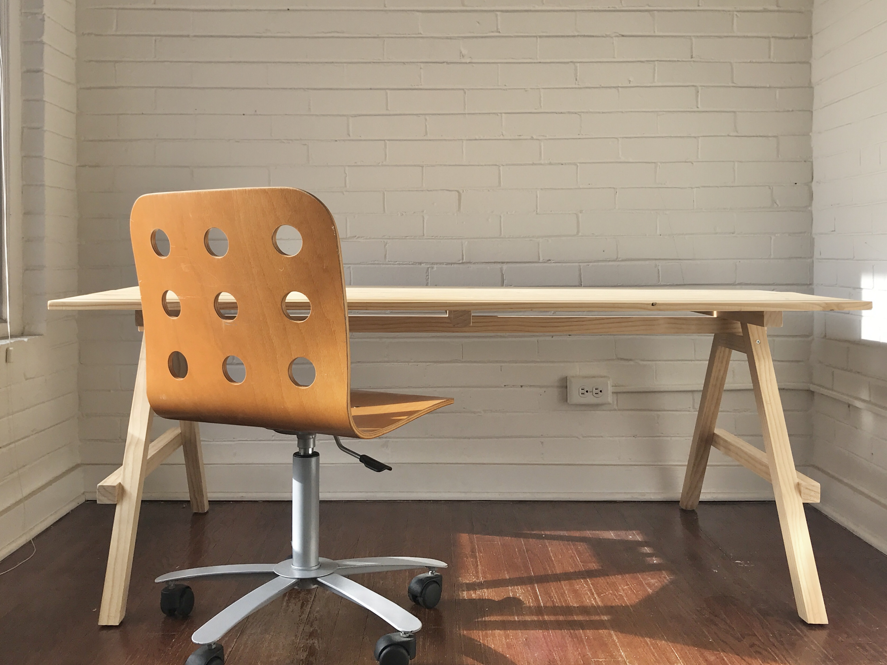
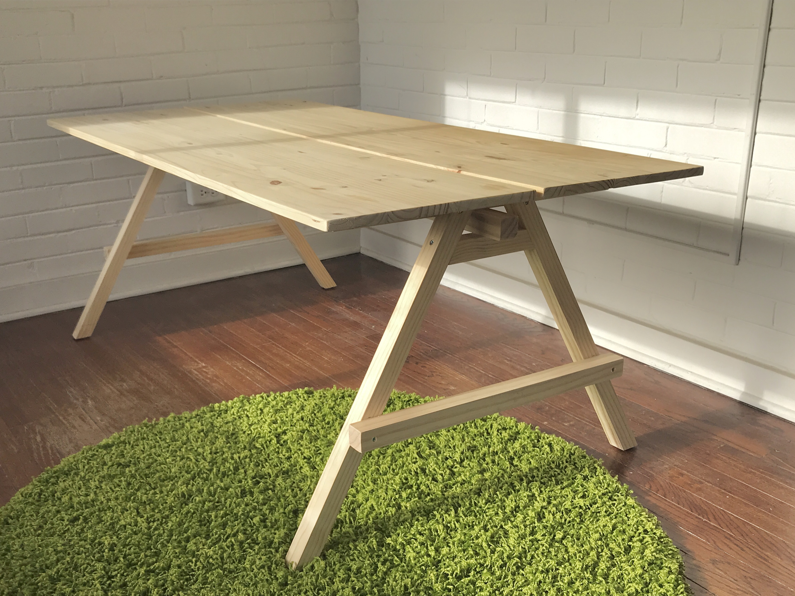
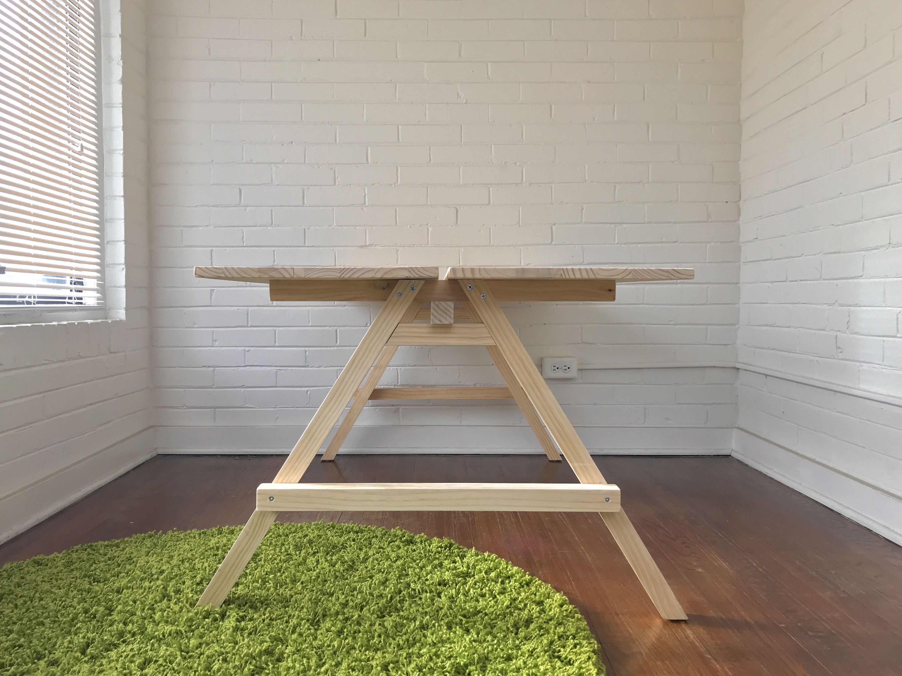
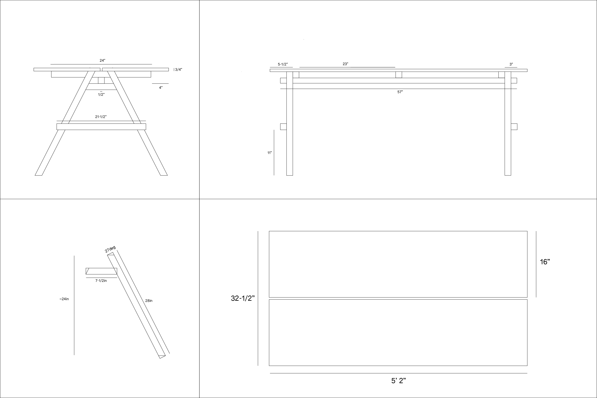

# studio-desk

# construction

I'd reccomend attatching all cross-beams to the desktop first, then attatching the legs. for the legs, I attatched the smallest peice that goes under the beam first, then clamped a leg to that piece and drilled it in. I added the longer beam connecting the legs last

note that the legs are **very** short (about 24"). this is my preffered height for musical instruments, but you may want to make yours taller.

# materials

materials can be sourced from most lowes stores in the united states

- solid pine

  | W x H (in) | length (in) |	qty |
  | ---------- | ---------------- | --- |
  | 1-1/2 x 1-1/2 |	96 |	3 |
  | 1-1/2 x 1-1/2	| 72 |	1 
  | 16 x 3/4 |	72 |	2 |
  
  look for "edge glued boards" for the desktop. alternatively you can use plywood, which is cheaper but more difficult to cut and sand with hand tools. 
  
- wood screws
  - #10 x 2-1/2"
  - #10 x 2"

- sand paper

# tools

while a miter saw & table saw will make the most accurate cuts, I was able to build this piece fairly easily with a small selection of hand tools.

- tape measure
- square
- pencil
- woodworking protractor
- ryoba (japanese hand saw)
- clamps
- screw driver (+ impact driver)
- countersink or countersink bit
- sand paper block

the angle cuts are a little tricky to get right with the ryoba, so be sure to practice measuring and cutting angles before attempting this piece. you're able to get away without great accuracy due to the flexibility of the wood.
